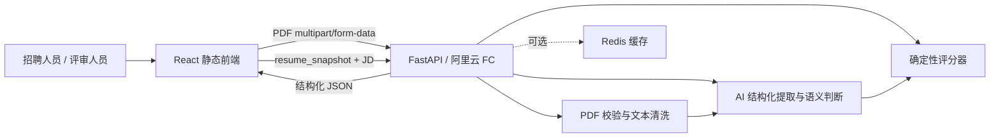

# 面向 Serverless 的智能简历分析系统设计

## 设计目标与约束

系统需要在 24 小时内完成并公开部署，因此设计重点是清晰的模块边界、稳定的接口和可验证的降级行为，而不是堆叠基础设施。后端使用 Python、FastAPI 和 Pydantic，PDF 文本提取使用 pypdf；前端使用 React、TypeScript 和 Vite。AI 服务通过兼容结构化 JSON 输出的 HTTP API 接入，具体供应商和模型由环境变量配置。

阿里云函数计算实例可能冷启动、回收或并发扩容，跨请求状态不能保存在进程内存中。系统选择两阶段同步、无状态回传：第一阶段返回完整 `resume_snapshot`，第二阶段由前端把快照连同 JD 传回。Redis 只提供缓存加速，关闭后不会破坏接口语义。

## 系统边界



浏览器只负责文件选择、状态展示和短期保存快照。API 负责所有可信校验、PDF 解析、AI 调用和评分，任何 AI 密钥都不能出现在浏览器。系统不保存原始 PDF，也不建立候选人数据库。

## 后端模块划分

| 模块 | 职责 | 不承担的职责 |
| --- | --- | --- |
| API 层 | 解析请求、调用用例、映射状态码、生成 `request_id` | 不直接处理 PDF 或拼接模型 Prompt |
| Schema 层 | 定义 Pydantic 请求、响应和 AI 结构化输出 | 不包含业务算法 |
| PDF 服务 | 校验文件、读取页数、提取文本、清洗和生成内容哈希 | 不提取候选人语义字段 |
| Profile 服务 | 调用 AI、校验结果、执行电话与邮箱降级提取 | 不计算岗位匹配分 |
| JD 服务 | 提取和规范化岗位技能、职责关键词 | 不读取上传文件 |
| Match 服务 | 计算技能分、经历分和总分，整理证据 | 不直接访问 Web 框架对象 |
| Cache 服务 | 生成版本化键、序列化、读取和写入 Redis | 故障时不得阻断业务 |
| Observability | 结构化日志、耗时、降级和缓存命中记录 | 不记录完整个人信息 |

建议目录如下，开发时不得把所有逻辑堆入路由文件：

```text
backend/
  app/
    api/routes/
    core/
    schemas/
    services/
    main.py
  tests/
frontend/
  src/
    api/
    components/
    features/resume-analysis/
    types/
  tests/
docs/
```

## 简历解析数据流

上传接口先进行大小检查，再检查扩展名、MIME 和 `%PDF-` 文件头。pypdf 只在校验通过后以严格模式打开内存流，以页为单位使用布局感知模式提取文本并记录页数；提取时关闭推断垂直空行并保留旋转文本，避免定位式或跨页项目内容被重排。所有加密文档、结构损坏、超过 30 页或没有有效文本的文档在这一阶段结束，不能继续消耗 AI 调用额度。

解析同时执行两类独立限制：清洗后的业务文本最多 100,000 字符；pypdf 单流解压和跨页内容流累计最多 50 MiB，原始提取文本最多 1,000,000 字符。资源限制返回 `PDF_PROCESSING_LIMIT_EXCEEDED`，不得冒充业务文本超长，也不得在响应或日志中暴露底层解析器消息。

文本清洗保持保守原则。系统归一 `\r\n`、多余空格和连续空行，合并明显的行内断行，并根据多页重复情况移除常见页眉页脚。清洗不得重排工作经历、教育经历和项目经历的先后顺序，也不尝试恢复复杂双栏版式。

清洗后先以内容哈希查询解析缓存。缓存未命中时，Profile 服务要求 AI 按固定 Schema 输出候选人档案。AI 返回非 JSON、字段类型错误或超时时重试一次；第二次失败后，用确定性规则提取电话和邮箱，其余无法确认的字段为 `null`，响应标记为降级。

## 岗位匹配与评分

JD 服务输出技能关键词和职责关键词，执行大小写归一、首尾空白清理和去重。技能分由确定性公式计算：

```text
skill_match = matched_skill_count / jd_skill_count × 100
```

经历相关性由 AI 在 0 至 100 范围内评分，并必须返回来自简历的证据片段。评分器只接受确实存在于 `cleaned_text` 中的证据；无法验证的证据被丢弃。AI 不可用时，经历分退回职责关键词覆盖率，并设置 `method=rule_fallback`。

总分只有一套来源：

```text
overall_raw = 0.6 × skill_match + 0.4 × experience_relevance
overall = decimal_round_half_up(overall_raw)
```

AI 不得再生成独立总分，以免同一响应出现相互矛盾的结论。所有分数在输出前被限制到 0 至 100，总分采用十进制 0.5 向上取整，不使用语言运行时可能存在差异的默认舍入行为。

## 缓存设计

缓存键必须包含算法版本，避免 Prompt、字段或评分公式调整后复用旧数据。PDF 布局感知提取使用 `pdf-v2` 版本，因此不会命中旧版普通文本提取产生的缓存：

```text
extract:{pdf_sha256}:{extract_version}
match:{resume_hash}:{jd_hash}:{score_version}
```

两类缓存的 TTL 均为 24 小时，不保存原始 PDF。Redis 的连接、读取、反序列化和写入异常都转化为缓存未命中；业务响应通过 `cached` 字段说明是否命中，但不会把 Redis 异常暴露给使用者。

Redis 属于后端可信边界，只能由 API 使用受限凭据访问，不得暴露到浏览器或公网。缓存键同时绑定输入哈希、PDF/规则算法版本和对应 Prompt 版本；Prompt 或评分策略升级会自动使用新命名空间。缓存载荷仍须通过严格 Schema、降级状态和当前输入的确定性复核。若 Redis 凭据可能泄露，应先轮换凭据并清空缓存；本版本不把已被攻击者取得写权限的 Redis 视为可信数据源。

## 前端状态模型

单页界面包含四种显式状态：`idle`、`parsing`、`ready` 和 `matching`。解析完成后，`resume_snapshot` 只存在于页面内存中；刷新页面或点击重新分析时清除。界面不能把完整简历写入 Local Storage、Session Storage 或日志。

结果区先展示候选人档案，再展示总分、技能分、经历分、匹配关键词、缺失关键词和证据。`degraded=true` 时使用中性提示说明当前结果采用了降级规则，不把降级结果伪装成完整 AI 分析。

## 异常与恢复策略

| 异常 | 行为 |
| --- | --- |
| 文件格式或限制不符合要求 | 立即返回明确的 `4xx`，不调用 AI |
| PDF 无有效文本 | 返回 `PDF_NO_EXTRACTABLE_TEXT`，提示使用文本型 PDF |
| PDF 解压流或原始文本超过处理预算 | 返回 `PDF_PROCESSING_LIMIT_EXCEEDED`，不调用 AI |
| AI 第一次失败 | 在调用预算内重试一次 |
| AI 第二次失败 | 返回规则降级结果，设置警告和 `degraded=true` |
| Redis 不可用 | 跳过缓存，继续完成请求 |
| 前端请求中断 | 保留当前输入，允许使用者主动重试 |
| 快照结构被篡改或缺字段 | 返回 `422 INVALID_RESUME_SNAPSHOT` |

## 安全与隐私

后端只在请求生命周期内处理原始 PDF，临时文件必须在成功和异常路径中释放。日志允许记录 `request_id`、文件字节数、页数、处理耗时、模型名称、缓存命中和降级状态，但不能记录文件名以外的简历正文、联系方式、地址、JD 全文或密钥。

公开演示不设置登录，风险通过 10 MB 文件限制、30 页限制、AI 超时、FC 并发限制和云端调用额度控制。CORS 使用显式白名单，不允许在生产环境配置通配符来源。

## 部署拓扑

后端以 AMD64 自定义容器镜像发布到阿里云 Container Registry，再由同区域、同账号的 Function Compute 拉取。HTTP 服务监听 `0.0.0.0` 和 Function Compute 配置的 `CAPort`，默认按 9000 准备。阿里云官方文档说明自定义容器需内置 HTTP Server，且可写层不会持久保存，这与本设计不保存文件、无状态回传的原则一致。

前端构建产物通过 GitHub Actions 上传为 Pages artifact，再使用 `deploy-pages` 发布。生产 API 地址通过构建变量注入，仓库中不保存任何后端密钥。

## 已确认的架构决策

| 决策 | 选择 | 原因 |
| --- | --- | --- |
| 请求模型 | 两阶段同步 | 便于独立验证解析和评分，同时控制 24 小时实现范围 |
| 阶段状态 | 前端回传快照 | 避免跨 FC 实例状态依赖 |
| 匹配方法 | AI 与确定性规则混合 | 保留语义能力、可解释公式和故障降级 |
| Redis 定位 | 可选缓存 | 缓存失败不能使必选功能失效 |
| 本地 Docker | 只运行 Redis | 前后端直接运行，减少调试开销 |
| 云端后端 | FC 自定义容器 | 固化 Python 与 PDF 原生依赖，保证环境一致性 |

## 参考资料

- [阿里云 Function Compute：Custom container images](https://help.aliyun.com/en/functioncompute/fc/user-guide/custom-container/)
- [阿里云 Function Compute：Create a custom container function](https://help.aliyun.com/en/functioncompute/fc/create-a-custom-container-function-in-a-container-runtime)
- [GitHub Pages：Using custom workflows](https://docs.github.com/en/pages/getting-started-with-github-pages/using-custom-workflows-with-github-pages)
