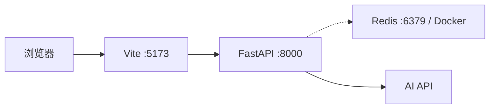

# 本地与云端部署规范

## 部署目标

开发环境以快速调试为主，前后端直接在本机运行，Docker Compose 只提供 Redis。生产环境需要公开访问：后端以自定义容器部署到阿里云函数计算（Function Compute，FC），前端通过 GitHub Actions 部署到 GitHub Pages。

这种分工避免了本地每次修改都重建镜像，同时使用容器固定 PyMuPDF 等二进制依赖。容器是后端生产交付形式，不是本地开发的强制前提。

## 本地开发拓扑



### 环境准备

- Python 3.12.13。
- Node.js 22 LTS 与 pnpm。
- Docker Desktop，仅在需要验证 Redis 缓存时使用。
- 一个支持结构化 JSON 输出的 AI API 凭据。

### Redis

根目录 `docker-compose.yml` 只定义 Redis，不打包前端和后端：

```bash
docker compose up -d redis
docker compose ps
```

未安装 Docker 或 Redis 未启动时，后端通过缺失 `REDIS_URL` 禁用缓存，全部 P0 功能仍应可用。

### 后端

脚手架完成后的标准启动方式：

```powershell
cd backend
python -m venv .venv
.\.venv\Scripts\Activate.ps1
python -m pip install -e ".[dev]"
Copy-Item .env.example .env
uvicorn app.main:app --reload --host 127.0.0.1 --port 8000
```

本地 `.env` 至少配置 `AI_BASE_URL`、`AI_API_KEY`、`AI_MODEL` 和 `CORS_ORIGINS=http://localhost:5173`。Redis 启用时增加 `REDIS_URL=redis://localhost:6379/0`。

### 前端

```powershell
cd frontend
pnpm install
Copy-Item .env.example .env.local
pnpm dev
```

`.env.local` 使用 `VITE_API_BASE_URL=http://localhost:8000/api/v1`。前端环境变量会进入浏览器构建产物，因此只能放公开 API 地址，不能包含密钥。

## 后端生产镜像

`backend/Dockerfile` 使用精简构建，最终镜像固定为 `python:3.12.13-slim-bookworm`。生产依赖由 `pip-tools` 从 `backend/pyproject.toml` 主依赖生成到 `backend/requirements.lock`，镜像使用 `--require-hashes` 安装后再复制应用代码。镜像只包含运行依赖、应用和必要字体，不复制测试资料、`.env`、Git 元数据或本地缓存。

阿里云 FC 自定义容器只支持 AMD64 镜像。构建命令必须显式指定平台：

```bash
docker build --platform linux/amd64 -t xingshi-resume-api:0.1.0 backend
```

HTTP 服务监听 `0.0.0.0` 和 FC 配置的 `CAPort`。部署基线使用 9000：

```text
uvicorn app.main:app --host 0.0.0.0 --port 9000
```

端口需要与 FC 的 `CAPort` 保持一致，不能监听 `127.0.0.1`。容器必须支持 Keep-Alive。健康检查路径为 `/api/v1/health`。

## 阿里云 Function Compute

镜像推送到阿里云 Container Registry（ACR），仓库与函数必须位于同一账号和区域。生产配置至少包含：

| 配置 | 要求 |
| --- | --- |
| 运行方式 | Web Function + Custom Container |
| 镜像架构 | `linux/amd64` |
| CAPort | 9000，与容器监听一致 |
| 超时时间 | 至少覆盖 PDF 解析、两次 AI 调用预算和响应序列化 |
| 内存 | 根据 PyMuPDF 和最大 10 MB PDF 的实测结果设置 |
| 临时磁盘 | 只用于请求生命周期临时文件，不依赖持久化 |
| 环境变量 | 按工程规范配置，不写入镜像 |
| HTTP 入口 | 自定义域名或 HTTP 触发器 |
| CORS | 生产前端域名白名单 |

阿里云文档说明 FC 默认域名可能为响应添加 `Content-Disposition: attachment`，公开 Web API 应优先绑定自定义域名并验证浏览器行为。FC 容器可写层会随实例销毁而丢失，系统不得将它当作简历存储。

生产环境发布后执行：

```bash
curl -fsS https://<api-domain>/api/v1/health
```

健康检查只能说明服务和配置状态，仍需按测试规范上传脱敏 PDF 完成端到端验证。

## 前端 GitHub Pages

前端使用 GitHub Actions 构建，不能把本地 `dist/` 手工提交到默认分支。工作流需要完成以下动作：检出代码、安装 pnpm、安装锁定依赖、执行 lint/类型检查/测试、构建、上传 Pages artifact、调用 `deploy-pages`。

GitHub 官方 Pages 工作流要求部署任务具有 `pages: write` 和 `id-token: write` 权限，并使用 `github-pages` environment。`VITE_API_BASE_URL` 通过 GitHub Actions Variable 注入；它不是 Secret，但生产 AI 密钥绝不能出现在 GitHub Pages 配置中。

Vite 的 `base` 根据部署方式设置：

- 仓库 Pages 地址 `https://<owner>.github.io/<repo>/`：使用 `/<repo>/`。
- 自定义域名：使用 `/`。

构建后至少检查首页、CSS、JavaScript 和字体资源不会返回 404。单页当前只有首页，不依赖服务器端 history fallback；新增前端路由时需要重新评估 Pages 刷新策略。

## 配置分层

| 环境 | API 来源 | CORS | Redis | 日志 |
| --- | --- | --- | --- | --- |
| 本地 | `http://localhost:8000` | `http://localhost:5173` | 可选 Docker | `DEBUG` 或 `INFO` |
| 测试 | 测试客户端 | 测试来源 | Fake/禁用 | 关闭正文日志 |
| 生产 | FC 自定义域名 | GitHub Pages 域名 | 云 Redis，可选 | `INFO`，JSON |

生产环境不得使用通配符 CORS，不得启用 FastAPI debug，不得在错误响应中返回 Traceback。

## 发布与回滚

每次发布使用不可变版本号标记镜像，例如 `0.1.0` 和 Git commit SHA，禁止只依赖 `latest`。FC 保留上一个验证通过的镜像引用；新版本健康检查或端到端验证失败时恢复上一镜像。前端通过 GitHub Pages deployment history 回滚到上一成功 artifact。

发布顺序固定为后端、后端验收、前端、前端验收。这样前端部署时可以注入已经确认可用的 API 地址。

## 发布检查表

- 后端镜像为 `linux/amd64`，不包含 `.env` 和测试 PDF。
- FC 监听地址、`CAPort` 和超时配置一致。
- AI 密钥只存在于 FC 环境变量或密钥服务。
- Redis 关闭时核心接口仍能工作。
- 自定义 API 域名支持 HTTPS，CORS 只允许生产前端。
- GitHub Pages 构建使用正确 `base` 和 `VITE_API_BASE_URL`。
- `/api/v1/health`、上传和评分流程在线验证通过。
- README 填写最终仓库、前端和后端地址。
- 公开仓库不包含个人简历、日志、密钥或云账号信息。

## 官方参考

- [阿里云 Function Compute：Custom container images](https://help.aliyun.com/en/functioncompute/fc/user-guide/custom-container/)
- [阿里云 Function Compute：Create a custom container function](https://help.aliyun.com/en/functioncompute/fc/create-a-custom-container-function-in-a-container-runtime)
- [阿里云 Function Compute：Web functions](https://help.aliyun.com/en/functioncompute/fc/web-functions)
- [GitHub Pages：Using custom workflows](https://docs.github.com/en/pages/getting-started-with-github-pages/using-custom-workflows-with-github-pages)
- [GitHub Pages：Configuring a publishing source](https://docs.github.com/en/pages/getting-started-with-github-pages/configuring-a-publishing-source-for-your-github-pages-site)

